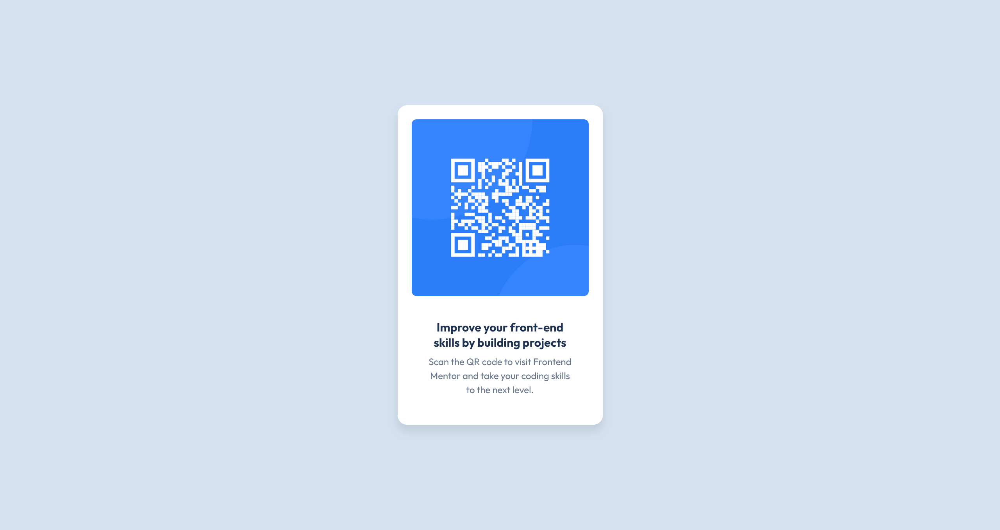

# Frontend Mentor - QR code component solution

This is a solution to the [QR code component challenge on Frontend Mentor](https://www.frontendmentor.io/challenges/qr-code-component-iux_sIO_H). Frontend Mentor challenges help you improve your coding skills by building realistic projects. 

## Table of contents

- [Frontend Mentor - QR code component solution](#frontend-mentor---qr-code-component-solution)
  - [Table of contents](#table-of-contents)
  - [Overview](#overview)
    - [Screenshot](#screenshot)
    - [Links](#links)
  - [My process](#my-process)
    - [Built with](#built-with)
    - [What I learned](#what-i-learned)
    - [Continued development](#continued-development)
    - [Useful resources](#useful-resources)
  - [Author](#author)

## Overview

### Screenshot



### Links

- Solution URL: [Add solution URL here](https://your-solution-url.com)
- Live Site URL: [Add live site URL here](https://your-live-site-url.com)

## My process

### Built with

- Semantic HTML5 markup with proper accessibility attributes
- CSS custom properties (CSS variables) for maintainable design system
- CSS Flexbox for centering and layout
- Mobile-first responsive design workflow
- Google Fonts (Outfit) with variable font support
- Modern CSS practices including HSL colors and smooth transitions

### What I learned

This project reinforced several important concepts for me:

**CSS Custom Properties & Design Systems**: I implemented a comprehensive design system using CSS variables for colors, spacing, typography, shadows, and transitions. This made the code much more maintainable and consistent.

```css
:root {
  --color-white: hsl(0, 0%, 100%);
  --color-light-gray: hsl(212, 45%, 89%);
  --spacing-sm: 1rem;
  --shadow-lg: 0 10px 15px rgba(0, 0, 0, 0.1);
}
```

**Accessibility Best Practices**: I learned the importance of proper semantic HTML structure, alt text for images, and focus management. The QR card is keyboard navigable and screen reader friendly.

```html
<main class="qr-card" role="main" tabindex="0">
  
</main>
```

**Performance Optimization**: I implemented preconnect links for Google Fonts, proper image sizing, and smooth transitions that enhance user experience without compromising performance.

**Responsive Design**: Using a mobile-first approach with CSS custom properties made it easy to create a design that works seamlessly across all device sizes.

### Continued development

Moving forward, I want to focus on:

- **CSS Grid**: While Flexbox worked perfectly for this simple layout, I want to practice CSS Grid for more complex layouts
- **CSS Animations**: I'd like to explore more advanced animations and micro-interactions
- **CSS-in-JS**: I'm interested in learning styled-components or emotion for larger projects
- **Accessibility Testing**: I want to learn more about automated accessibility testing tools

### Useful resources

- [CSS Custom Properties Guide](https://developer.mozilla.org/en-US/docs/Web/CSS/Using_CSS_custom_properties) - This helped me understand how to create a proper design system with CSS variables
- [Web.dev Accessibility](https://web.dev/accessibility/) - Great resource for learning accessibility best practices
- [CSS-Tricks Flexbox Guide](https://css-tricks.com/snippets/css/a-guide-to-flexbox/) - Excellent reference for Flexbox properties and use cases
- [Google Fonts Variable Fonts](https://fonts.google.com/knowledge/introducing_type/introducing_variable_fonts) - Helped me understand how to implement variable fonts for better performance

## Author

- Frontend Mentor - [@yourusername](https://www.frontendmentor.io/profile/yourusername)
- GitHub - [@yourusername](https://github.com/yourusername)

---

**Note**: Remember to replace the placeholder URLs and usernames with your actual information before submitting!
