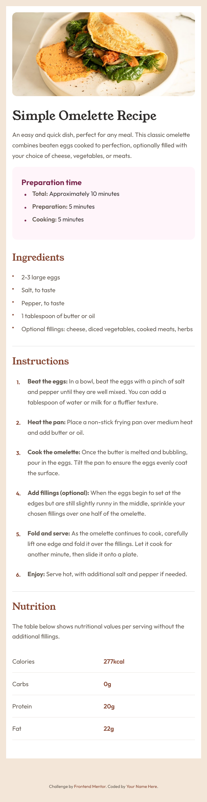
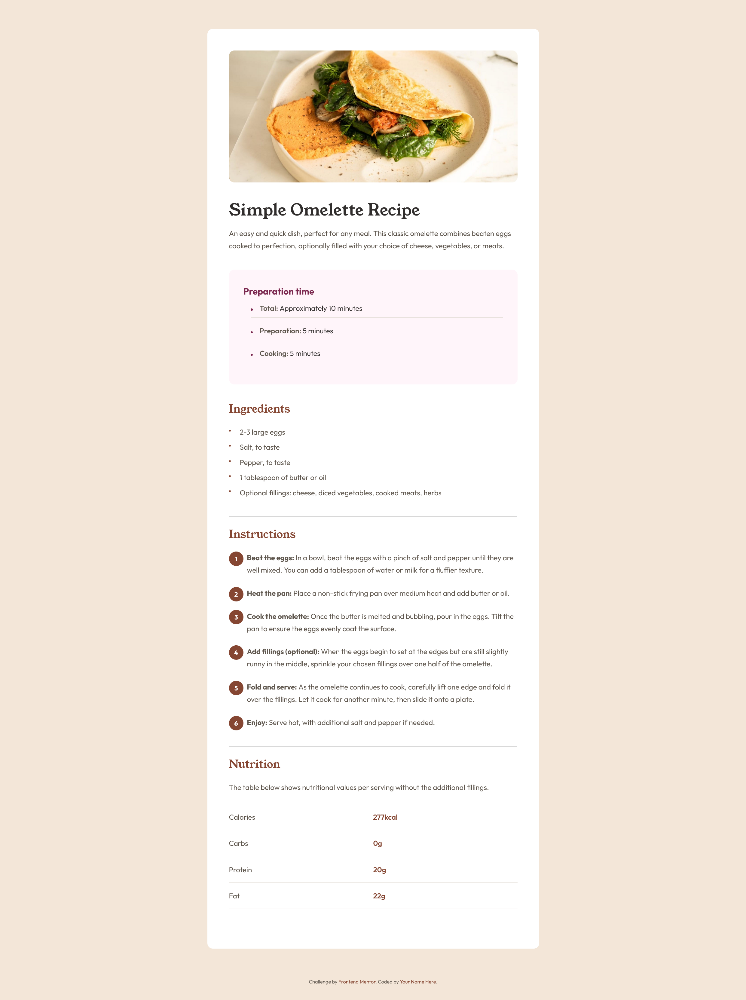

# Frontend Mentor - Recipe Page Challenge


## Overview

This is my solution to the [Recipe Page challenge](https://www.frontendmentor.io/challenges/recipe-page-QOogmKdls) from Frontend Mentor. The challenge involves building a responsive recipe page for a simple omelette recipe that looks as close to the provided design as possible.

## The Challenge

Build out a recipe page and get it looking as close to the design as possible. The design includes:

- A hero image of the omelette
- Recipe title and description
- Preparation time breakdown
- Ingredients list
- Step-by-step cooking instructions
- Nutritional information table
- Responsive design for mobile and desktop

## Features

- **Responsive Design**: Mobile-first approach with breakpoints at 375px and 1440px
- **Typography**: Uses Young Serif and Outfit fonts as specified
- **Color Scheme**: Implements the exact color palette from the style guide
- **Semantic HTML**: Proper structure with semantic elements
- **CSS Custom Properties**: Organized CSS with variables for maintainability
- **Accessibility**: WCAG compliant with proper contrast and semantic markup
- **Visual Separators**: Added horizontal rules between sections for better readability

## Technologies Used

- HTML5
- CSS3 (Custom Properties, Flexbox, Grid)
- Responsive Design Principles
- Semantic HTML

## Design Specifications

### Layout

- Mobile: 375px
- Desktop: 1440px

### Colors

- White: hsl(0, 0%, 100%)
- Stone 100: hsl(30, 54%, 90%) - Background color
- Stone 150: hsl(30, 18%, 87%) - Border and separator colors
- Stone 600: hsl(30, 10%, 34%) - Body text color
- Stone 900: hsl(24, 5%, 18%) - Heading color
- Brown 800: hsl(14, 45%, 36%) - Section headers and accent color
- Rose 800: hsl(332, 51%, 32%) - Preparation time header
- Rose 50: hsl(330, 100%, 98%) - Preparation time background

### Typography

- **Young Serif**: 400 weight for main headings (h1, h2)
- **Outfit**: 400, 600, 700 weights for body text and other headings
- Base font size: 16px

## Project Structure

```bash
recipe-page/
├── assets/
│   ├── fonts/
│   │   ├── outfit/          # Outfit font family
│   │   └── young-serif/     # Young Serif font family
│   └── images/              # Recipe images and favicon
├── design/                   # Design mockups
├── results/                  # Screenshots of completed challenge
├── styles/                   # CSS files
│   ├── variables.css        # CSS custom properties
│   ├── global.css           # Base styles and typography
│   └── index.css            # Component-specific styles
├── index.html               # Main HTML file
└── README.md                # This file
```

## Getting Started

1. Clone the repository
2. Open `index.html` in your browser
3. Or use a local development server

## Current Implementation Status

### ✅ Completed

- **HTML Structure**: Semantic HTML with proper sections and accessibility
- **CSS Architecture**: Three-tier CSS structure with variables, global styles, and components
- **Typography**: Font imports and proper font family assignments
- **Layout**: Responsive container with proper spacing
- **Visual Elements**:
  - Hero image with border radius
  - Preparation time section with rose background
  - Ingredients list with custom bullet points
  - Instructions with numbered circles
  - Nutrition table with proper borders
  - Horizontal separators between sections

### 🎨 Design Features

- **Background**: Light stone background (hsl(30, 54%, 90%))
- **Container**: White background with rounded corners on desktop
- **Preparation Time**: Rose-tinted background with custom bullet points
- **Section Headers**: Brown color (hsl(14, 45%, 36%))
- **Ingredients**: Custom bullet points using CSS pseudo-elements
- **Instructions**: Numbered circles with brown background
- **Nutrition Table**: Clean table design with proper borders

### 📱 Responsive Design

- Mobile-first approach
- Breakpoints at 375px and 1440px
- Adaptive spacing and typography
- Container padding adjustments for different screen sizes

## My Approach

1. **HTML Structure**: Started with semantic HTML structure, organizing content logically
2. **CSS Architecture**: Used CSS custom properties for colors and typography
3. **Responsive Design**: Mobile-first approach with progressive enhancement
4. **Typography**: Implemented the exact font specifications from the style guide
5. **Layout**: Used Flexbox and Grid for responsive layouts
6. **Visual Polish**: Added horizontal rules and custom bullet points for better UX

## Challenges & Learnings

- **Font Implementation**: Working with multiple font families and weights
- **Color Accuracy**: Matching the exact HSL values from the style guide
- **Responsive Typography**: Ensuring text scales appropriately across devices
- **Layout Consistency**: Maintaining visual hierarchy across different screen sizes
- **CSS Pseudo-elements**: Using ::before for custom bullet points and numbering
- **Visual Separators**: Adding horizontal rules for better content organization
- **CSS Counters**: Learned about CSS counter-reset and counter-increment for creating custom numbered lists in the instructions section

## Results

Check the `results/` folder for screenshots of the completed challenge at different screen sizes.

### Preview Images




## Frontend Mentor Profile

[My Frontend Mentor profile](https://www.frontendmentor.io/profile/ecruz-js)

---

**Challenge by [Frontend Mentor](https://www.frontendmentor.io?ref=challenge)**
