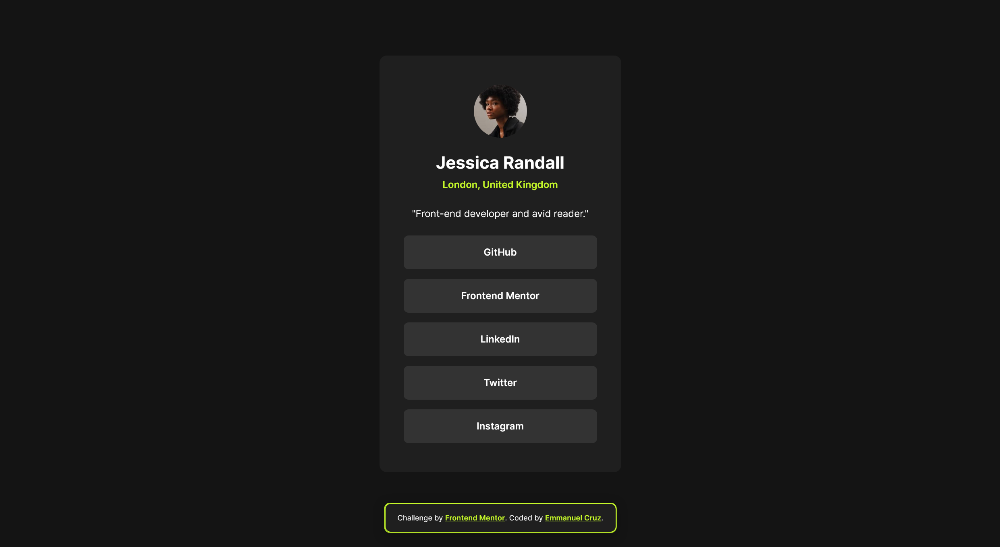
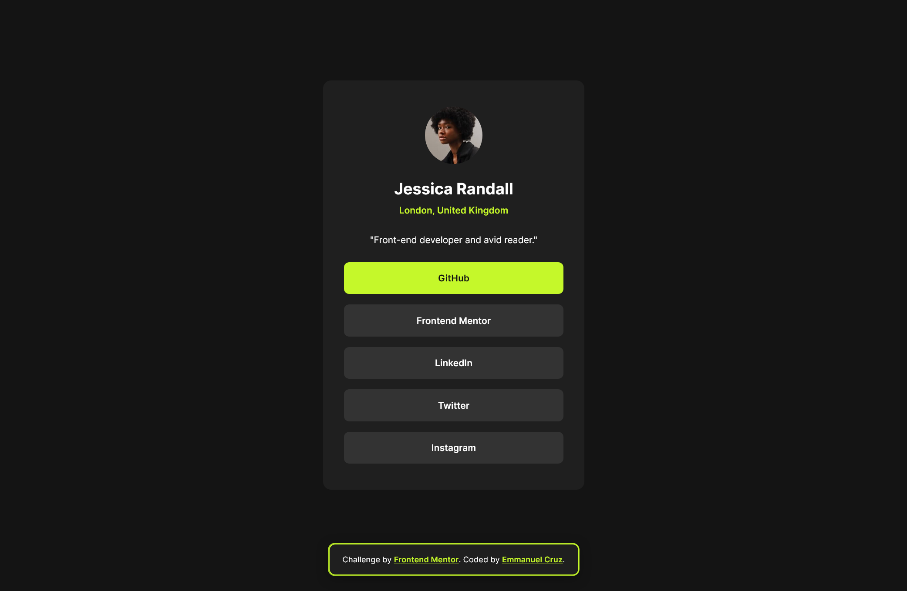

# Frontend Mentor - Social links profile solution

This is a solution to the [Social links profile challenge on Frontend Mentor](https://www.frontendmentor.io/challenges/social-links-profile-2d0x1e5a). Frontend Mentor challenges help you improve your coding skills by building realistic projects.

## Table of contents

- [Frontend Mentor - Social links profile solution](#frontend-mentor---social-links-profile-solution)
  - [Table of contents](#table-of-contents)
  - [Overview](#overview)
    - [Screenshots](#screenshots)
    - [Links](#links)
  - [My process](#my-process)
    - [Built with](#built-with)
    - [What I learned](#what-i-learned)
    - [Continued development](#continued-development)
    - [Useful resources](#useful-resources)
  - [Author](#author)

## Overview

### Screenshots



**Active States:**


The design includes hover and focus states for all interactive elements, with social links changing to green background on hover.

### Links

- Live Site URL: [Add your live site URL here]
- Solution URL: [Add your Frontend Mentor solution URL here]

**Note**: This project can be hosted on platforms like Netlify, Vercel, or GitHub Pages for live preview.

## My process

### Built with

- Semantic HTML5 markup with proper accessibility attributes
- CSS custom properties (CSS variables) for maintainable design system
- CSS Flexbox for layout and centering
- Mobile-first responsive design workflow
- Local Inter font files with variable font support
- Modern CSS practices including HSL colors and smooth transitions
- Hover states and focus accessibility
- Professional attribution styling with floating card design

### What I learned

This project reinforced several important concepts for me:

**CSS Custom Properties & Design Systems**: I implemented a comprehensive design system using CSS variables for colors, typography, and spacing. This made the code much more maintainable and consistent.

```css
:root {
  --color-green: hsl(75, 94%, 57%);
  --color-white: hsl(0, 0%, 100%);
  --color-grey-700: hsl(0, 0%, 20%);
  --color-grey-800: hsl(0, 0%, 12%);
  --color-grey-900: hsl(0, 0%, 8%);
  --font-weight-regular: 400;
  --font-weight-semibold: 600;
  --font-weight-bold: 700;
}
```

**Local Font Implementation**: I learned how to properly implement local font files using @font-face declarations, including variable fonts for better performance and flexibility.

```css
@font-face {
  font-family: 'Inter';
  src: url('../assets/fonts/Inter-VariableFont_slnt,wght.ttf') format('truetype-variations');
  font-weight: 400 700;
  font-style: normal;
}
```

**Interactive Component Design**: I practiced creating a social links profile component with proper hover states, focus management, and accessibility features.

**Responsive Layout**: Using a mobile-first approach with CSS custom properties made it easy to create a design that works seamlessly across all device sizes, from 375px mobile to 1440px desktop.

**Professional Attribution Styling**: I implemented a floating attribution card that enhances the overall design while maintaining accessibility and user experience.

### Continued development

Moving forward, I want to focus on:

- **CSS Grid**: While Flexbox worked perfectly for this layout, I want to practice CSS Grid for more complex layouts
- **CSS Animations**: I'd like to explore more advanced animations and micro-interactions
- **CSS-in-JS**: I'm interested in learning styled-components or emotion for larger projects
- **Accessibility Testing**: I want to learn more about automated accessibility testing tools
- **Performance Optimization**: I want to explore font loading strategies and image optimization techniques

### Useful resources

- [CSS Custom Properties Guide](https://developer.mozilla.org/en-US/docs/Web/CSS/Using_CSS_custom_properties) - This helped me understand how to create a proper design system with CSS variables
- [CSS @font-face Rule](https://developer.mozilla.org/en-US/docs/Web/CSS/@font-face) - Essential for implementing local fonts
- [CSS-Tricks Flexbox Guide](https://css-tricks.com/snippets/css/a-guide-to-flexbox/) - Excellent reference for Flexbox properties and use cases
- [Variable Fonts Guide](https://web.dev/variable-fonts/) - Helped me understand how to implement variable fonts for better performance
- [Frontend Mentor Style Guide](https://www.frontendmentor.io/learn) - Great resource for understanding design requirements and best practices

## Author

- **Emmanuel Cruz** - Frontend Developer
- GitHub - [@ecruz-js](https://github.com/ecruz-js)
- Frontend Mentor - [Your Frontend Mentor Profile]
